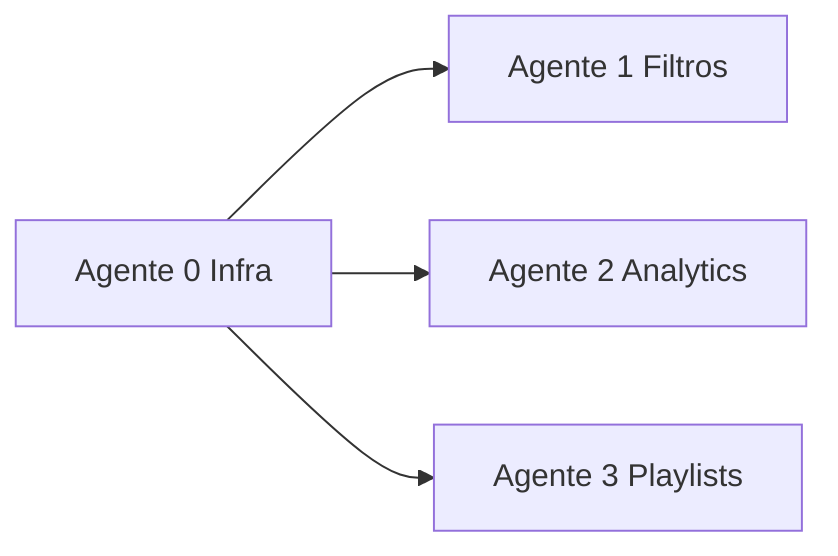
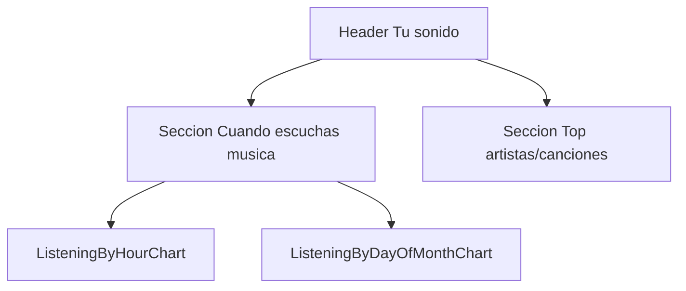

# Plan: 4 agentes — Spotify Search React

Roadmap de funcionalidades futuras: infra compartida, filtros de búsqueda con shadcn, analytics con gráficos y resumen de playlists. Sin endpoints deprecated. Atribución Spotify en footer.

## Orden de ejecución



| Orden | Agente | Bloquea a | Puede ir en paralelo con |
|-------|--------|-----------|---------------------------|
| 1º | **Agente 0** | Todos | — |
| 2º | **Agentes 1, 2, 3** | — | Entre sí (ramas distintas) |

**Regla:** El Agente 0 debe mergearse antes que 1–3. Los agentes 1–3 no deben editar los mismos archivos salvo acuerdo explícito.

---

## Contexto del proyecto (todos los agentes)

### Stack

- React 19, Vite 6, TypeScript 5, Tailwind v4 (`@tailwindcss/vite`), Redux Toolkit + redux-persist, React Router v7, pnpm.
- Path aliases: `@domain/*`, `@infrastructure/*`, `@application/*`, `@ui/*`, `@config/*`.
- Estilo: fondo zinc oscuro, acento `#1DB954` (`spotify-green`), utilidades `glass` / `glass-strong` en [`src/index.css`](src/index.css).

### Arquitectura (clean)

```
ui → application → infrastructure → domain
```

No importar UI desde domain/infrastructure. No importar infrastructure desde domain.

### Reglas Spotify (obligatorias)

- OpenAPI: https://developer.spotify.com/reference/web-api/open-api-schema.yaml
- **No usar endpoints marcados `deprecated: true`.**
- PKCE en cliente; nunca Client Secret en frontend.
- Scopes mínimos; refresh de token ya en [`SessionBootstrap`](src/ui/providers/SessionBootstrap.tsx).
- Rate limit 429: respetar `Retry-After` (mejora opcional en [`httpClient.ts`](src/infrastructure/http/httpClient.ts)).
- No cachear contenido Spotify más allá de la sesión UI; no entrenar ML con datos Spotify.
- Atribución a Spotify visible (footer — lo implementa Agente 0).

### Estado actual relevante

| Área | Archivo | Notas |
|------|---------|-------|
| Búsqueda | [`src/infrastructure/spotify/spotifyApi.ts`](src/infrastructure/spotify/spotifyApi.ts) | Bug: usa `query=`; API exige `q=` |
| Dashboard | [`src/ui/pages/Dashboard/DashboardPage.tsx`](src/ui/pages/Dashboard/DashboardPage.tsx) | Solo artistas + tracks |
| Search UI | [`src/ui/components/SearchForm/SearchForm.tsx`](src/ui/components/SearchForm/SearchForm.tsx) | Debounce 400ms |
| OAuth | [`src/config/oauth.ts`](src/config/oauth.ts) | Solo `user-read-private` hoy |
| Rutas | [`src/ui/App.tsx`](src/ui/App.tsx) | `/`, `/login`, `/not-found` |
| HTTP | [`src/infrastructure/http/httpClient.ts`](src/infrastructure/http/httpClient.ts) | GET + Bearer |

### Calidad (cada agente al terminar)

```bash
pnpm test && pnpm lint && pnpm build
```

---

# Agente 0 — Infraestructura compartida

## Objetivo

Preparar layout, navegación, OAuth con todos los scopes, rutas placeholder y footer de atribución Spotify. **No implementar lógica de filtros, analytics ni playlists.**

## Entregables

### 1. OAuth — scopes unificados en login

Archivo: [`src/config/oauth.ts`](src/config/oauth.ts)

```ts
const SCOPES = [
  "user-read-private",
  "user-top-read",
  "user-read-recently-played",
  "playlist-read-private",
];
```

El usuario eligió **todos los scopes en el login inicial** (un solo flujo). Actualizar copy en [`LoginPage`](src/ui/pages/Login/LoginPage.tsx) si hace falta.

### 2. Layout `AppShell`

- `src/ui/layouts/AppShell.tsx` — estructura: `Navbar` + `<Outlet />` + `SpotifyFooter`.
- Páginas autenticadas (`/`, `/insights`, `/playlists`) usan `AppShell`.
- `/login` y `/not-found` sin shell o con footer según diseño (footer también en login para atribución).

### 3. `SpotifyFooter`

- `src/ui/components/SpotifyFooter/SpotifyFooter.tsx`
- Texto: **"Los datos musicales los proporciona Spotify"**
- Enlace: `https://www.spotify.com`
- Logo: [`public/spotify.svg`](public/spotify.svg)
- Estilo: `glass`, texto zinc-400, pequeño, centrado.

### 4. Navegación

Extender [`src/ui/components/Navbar/Navbar.tsx`](src/ui/components/Navbar/Navbar.tsx):

| Link | Ruta | Label |
|------|------|-------|
| Buscar | `/` | Search / Buscar |
| Insights | `/insights` | Insights |
| Playlists | `/playlists` | Playlists |

Indicar ruta activa (`useLocation`). Mantener botón Logout.

### 5. Rutas en App

[`src/ui/App.tsx`](src/ui/App.tsx):

- Lazy load `InsightsPage`, `PlaylistInsightsPage` (placeholders mínimos: título + "Próximamente" o página vacía protegida por sesión).
- Envolver rutas autenticadas con `AppShell`.
- Mantener redirect OAuth `code` → `/login`.

Placeholders sugeridos:

- `src/ui/pages/Insights/InsightsPage.tsx` — shell para Agente 2.
- `src/ui/pages/PlaylistInsights/PlaylistInsightsPage.tsx` — shell para Agente 3.

### Archivos que PUEDE tocar

`oauth.ts`, `App.tsx`, `Navbar.tsx`, `LoginPage.tsx` (copy), `AppShell.tsx`, `SpotifyFooter/*`, placeholders Insights/PlaylistInsights.

### Archivos que NO debe tocar

`spotifyApi.ts`, `SearchForm`, `DashboardPage`, domain/search, application/analytics, application/playlist.

### Criterios de aceptación

- [ ] Login pide los 4 scopes.
- [ ] Footer visible en rutas autenticadas y login.
- [ ] Nav funciona entre `/`, `/insights`, `/playlists`.
- [ ] `pnpm test && pnpm lint && pnpm build` pasan.

---

# Agente 1 — Filtros avanzados de búsqueda

## Objetivo

Búsqueda con filtros visuales (selectores + slider), presets, badges de filtros activos y corrección del param `q`.

## Dependencias

- **Agente 0 completado** (AppShell, rutas, scopes).
- Asume sesión válida y `accessToken` en Redux como hoy.

## Principios UX

- El usuario **nunca ve ni edita** sintaxis `q` (`artist:`, `year:`, etc.).
- `buildSpotifyQuery` (domain) genera `q` internamente.
- Filtros activos = **badges legibles** ("Jazz", "1955–1960", "Miles Davis"), removibles individualmente.

## Setup shadcn/ui

1. `pnpm dlx shadcn@latest init` — Vite + React + Tailwind v4; aliases coherentes con [`tsconfig.json`](tsconfig.json) (`@ui/components`).
2. Tematizar variables en [`src/index.css`](src/index.css): `--background`, `--primary` → zinc + `#1DB954`.
3. Instalar componentes:

| Componente | Uso |
|----------|-----|
| `select` | Género, lanzamiento |
| `slider` | Rango de años |
| `button` | Clear, limpiar |
| `badge` | Filtros activos, presets |
| `collapsible` | Panel filtros |
| `popover` + `command` | Selector artista typeahead |
| `input` | Barra búsqueda |
| `switch` o `checkbox` | Mostrar álbumes |
| `label` | Accesibilidad |

- shadcn en `src/ui/components/ui/`
- Feature en `src/ui/components/SearchFilters/`

## API (no deprecated)

| Uso | Endpoint |
|-----|----------|
| Búsqueda principal | `GET /search?q=...&type=...&limit=10` |
| Typeahead artista | `GET /search?q=...&type=artist&limit=10` |

### Mapeo UI → `q` (interno)

| Control | Campo estado | `q` generado |
|---------|--------------|--------------|
| Input texto | `text` | término libre |
| Selector artista | `artistName` | `artist:{name}` |
| Selector género | `genre` | `genre:{value}` |
| Slider año | `yearFrom` / `yearTo` o vacío | `year:1955-1960` o `year:1960` |
| Selector lanzamiento | `albumTag` | `tag:new` / `tag:hipster` |

## Domain / application

| Archivo | Responsabilidad |
|---------|-----------------|
| `src/domain/search/types.ts` | `SearchFilters`, enums |
| `src/domain/search/searchFilterOptions.ts` | Listas para selects |
| `src/domain/search/buildSpotifyQuery.ts` | Compositor `q` |
| `src/domain/search/searchPresets.ts` | Presets → valores de controles |
| `src/domain/search/buildSpotifyQuery.spec.ts` | Tests |

### `searchFilterOptions.ts`

- **Género:** jazz, rock, pop, electronic, hip-hop, classical, latin, metal, indie, folk, soul, r&b, country, reggae, blues, funk, punk, ambient, instrumental + "Cualquier género".
- **Lanzamiento:** Cualquiera | Novedades (`tag:new`) | Underground (`tag:hipster`). Hint: "Afecta principalmente a álbumes".

### Presets (badges bajo la barra)

| Preset | Efecto |
|--------|--------|
| Jazz clásico | genre=jazz, año 1950–1970 |
| Últimas 2 semanas | lanzamiento=novedades |
| Underground | lanzamiento=underground |
| Instrumentales | genre=instrumental |
| Limpiar todo | reset completo |

## `YearRangeFilter`

- shadcn `Slider` dual: min **1920**, max **año actual**.
- Estado inicial: **sin filtro** (no enviar `year:` hasta interacción).
- Botón **Clear**: resetea año a vacío.
- `aria-label` + valores anunciados.

## Infraestructura

Actualizar [`src/infrastructure/spotify/spotifyApi.ts`](src/infrastructure/spotify/spotifyApi.ts):

```ts
export async function searchSpotify(
  q: string,
  accessToken: string,
  options?: { types?: string; limit?: number }
): Promise<SpotifySearchResponse | null>
// URL: .../search?q=${encodeURIComponent(q)}&type=...&limit=10
```

Añadir si conviene: `searchArtists(query, token)` → `type=artist`.

Exportar en [`src/infrastructure/spotify/index.ts`](src/infrastructure/spotify/index.ts).

## UI — componentes

```
SearchForm (refactor)
├── Input búsqueda (debounce 400ms)
├── PresetBadges
├── ActiveFilterBadges (removibles + "Limpiar todo")
├── Collapsible "Filtros"
│   ├── GenreSelect
│   ├── ReleaseSelect
│   ├── ArtistCombobox (Popover+Command, min 2 chars)
│   ├── YearRangeFilter
│   └── Switch "Mostrar álbumes"
```

### Dashboard

[`DashboardPage.tsx`](src/ui/pages/Dashboard/DashboardPage.tsx):

- Recibir `q` compuesto desde `SearchForm` (misma firma `onSearch(term)` o `onSearch(q)`).
- Si "Mostrar álbumes": `type` incluye `album` + sección Albums (nuevo listado o cards simples).

## Archivos que PUEDE tocar

`spotifyApi.ts`, `SearchForm/*`, `SearchFilters/*`, `domain/search/*`, `DashboardPage.tsx`, `index.css` (variables shadcn), `components/ui/*`, `package.json` (shadcn deps).

## Archivos que NO debe tocar

`App.tsx` (salvo import mínimo si necesario), `Navbar`, `oauth.ts`, `InsightsPage`, `PlaylistInsightsPage`, `uiSlice` (no requerido).

## Tests

- `buildSpotifyQuery.spec.ts` — texto, artist+genre, rango, año único, tag:new, clear año.
- `YearRangeFilter.spec.tsx` — clear, emisión de rango.
- `spotifyApi.spec.ts` — param `q` en URL.

## Criterios de aceptación

- [ ] Filtros son selectores/slider, no sintaxis visible.
- [ ] Presets rellenan controles.
- [ ] Slider 1920–año actual con clear.
- [ ] Badges activos removibles.
- [ ] Búsqueda usa `q=` correcto.
- [ ] shadcn tematizado coherente con app.
- [ ] `pnpm test && pnpm lint && pnpm build` pasan.

---

# Agente 2 — Analytics personales

## Objetivo

Página `/insights` con gráficos de hábitos de escucha (hora del día, día del mes) y ranking de top artistas/canciones. **Sin cruzar con historial de búsquedas** (`uiSlice`).

## Dependencias

- **Agente 0 completado** (ruta `/insights`, scopes, AppShell, footer).
- **shadcn** idealmente del Agente 1; si corre antes, ejecutar `shadcn init` mínimo + `chart` solo.

## API (no deprecated)

| Uso | Endpoint | Scope |
|-----|----------|-------|
| Top artistas/canciones | `GET /me/top/{type}?time_range=short_term\|medium_term\|long_term&limit=20` | `user-top-read` |
| Historial temporal | `GET /me/player/recently-played?limit=50` + paginación `before` / `cursors` | `user-read-recently-played` |

`type` en top: `artists` | `tracks`.

**No usar:** `audio-features`, `recommendations`, endpoints deprecated, [`uiSlice`](src/application/store/ui/uiSlice.ts).

## Limitación API (mostrar en UI)

`recently-played` no es analytics oficial. Implementar:

1. Paginar hasta **10 × 50** ítems o hasta `played_at` &lt; **30 días** atrás.
2. Agregar en cliente.
3. Nota bajo gráficos: *"Basado en tus reproducciones recientes en Spotify (hasta ~30 días)."*

No persistir historial en Redux/localStorage.

## Application layer

`src/application/analytics/aggregateListeningHabits.ts`:

- Input: `{ played_at: string }[]`
- Output:
  - `byHour: number[24]` — uso por hora del día
  - `byDayOfMonth: number[31]` — uso por día del calendario (1–31)
  - `totalPlays`, `dateRange` (opcional)

Normalizar para gráficos (porcentaje o 0–max).

## Infrastructure

| Archivo | Funciones |
|---------|-----------|
| `src/infrastructure/spotify/spotifyTopApi.ts` | `getUserTopItems(type, timeRange, token)` |
| `src/infrastructure/spotify/spotifyRecentlyPlayedApi.ts` | `getRecentlyPlayedPage`, `fetchRecentPlayHistory({ maxPages, since })` |
| `src/domain/models/PlayHistory.ts` | Tipos |

Exportar en `src/infrastructure/spotify/index.ts`.

## Gráficos — Recharts + shadcn Chart

```bash
pnpm add recharts
pnpm dlx shadcn@latest add chart
```

| Componente | Datos | Título |
|------------|-------|--------|
| `ListeningByHourChart` | `byHour` (24 barras, 00h–23h) | "¿A qué hora escuchas más?" |
| `ListeningByDayOfMonthChart` | `byDayOfMonth` (31 barras) | "¿Qué días del mes escuchas más?" |

Ubicación: `src/ui/components/insights/`

Estilo: `--primary` / spotify-green, fondo `glass`, `ChartTooltip`.

## UI — `InsightsPage`

Reemplazar placeholder en `src/ui/pages/Insights/InsightsPage.tsx`.



**Sección 1 (arriba):** grid 2 cols desktop / 1 móvil; skeleton al cargar; vacío si pocos datos.

**Sección 2 (abajo):**

- Tabs: 4 semanas (`short_term`) | 6 meses (`medium_term`) | 1 año (`long_term`)
- Toggle: Artistas | Canciones
- Lista 1–20: imagen, nombre, barra popularidad relativa; géneros en artistas.

**General:**

- Subtítulo: datos de escucha Spotify, no de búsquedas.
- 403 → "Vuelve a iniciar sesión" (scopes).
- `Navigate` si no hay sesión (como Dashboard).

## Archivos que PUEDE tocar

`InsightsPage.tsx`, `components/insights/*`, `application/analytics/*`, `spotifyTopApi.ts`, `spotifyRecentlyPlayedApi.ts`, `domain/models/PlayHistory.ts`, `infrastructure/spotify/index.ts`, `package.json` (recharts).

## Archivos que NO debe tocar

`SearchForm`, `DashboardPage`, `domain/search/*`, `uiSlice`, `PlaylistInsightsPage`, `oauth.ts`, `Navbar`, `App.tsx` (salvo quitar placeholder si está inline).

## Tests

- `aggregateListeningHabits.spec.ts`
- Mock paginación `fetchRecentPlayHistory`
- Render charts con fixture
- Cambio `time_range` dispara nuevo fetch top

## Criterios de aceptación

- [ ] Dos gráficos visibles con datos reales o fixture.
- [ ] Top items con 3 rangos temporales.
- [ ] Sin uso de `uiSlice` / searchTerms.
- [ ] Nota de limitación ~30 días visible.
- [ ] `pnpm test && pnpm lint && pnpm build` pasan.

---

# Agente 3 — Resumen de playlists (tags de estilo)

## Objetivo

Página `/playlists`: elegir una playlist del usuario, analizar sus canciones y mostrar **tags de estilo** arriba (jazz, relax, motivation, 80s, etc.).

## Dependencias

- **Agente 0 completado** (ruta `/playlists`, scope `playlist-read-private`, AppShell).
- shadcn opcional (Agente 1); puede usar `Badge`, `Select`, `Skeleton` de shadcn o estilo `glass` existente.

## API (no deprecated)

| Paso | Endpoint |
|------|----------|
| Listar playlists | `GET /me/playlists` |
| Detalle | `GET /playlists/{playlist_id}` |
| Items | `GET /playlists/{playlist_id}/items` (**no** `/tracks`) |
| Géneros | `GET /artists/{id}` por cada artista (**no** `GET /artists` batch) |

**No usar:** `/audio-features`, `/audio-analysis`, `/recommendations`, `/playlists/{id}/tracks`.

## Limitación producto

`items` solo si el usuario es **propietario o colaborador**. Usar solo playlists de `/me/playlists`. Si `403`: mensaje claro.

## Pipeline — `analyzePlaylist.ts`

`src/application/playlist/analyzePlaylist.ts`:

1. Paginar items (hasta 100 tracks, `limit=50`, 2 páginas).  
   `fields=items(item(id,name,popularity,explicit,artists(id),album(release_date)))`
2. Extraer artist IDs únicos (máx. 30, priorizar más frecuentes en la playlist).
3. `GET /artists/{id}` en paralelo (concurrencia 5), respetar 429.
4. `derivePlaylistTags()` → top 6–10 tags.

`src/application/playlist/derivePlaylistTags.ts` + `genreToMoodMap.ts` (config estática):

| Señal | Tags ejemplo |
|-------|----------------|
| Géneros agregados por frecuencia | jazz, rock, electronic |
| Mapa género→mood | chill/ambient→relax; workout→motivation; instrumental→instrumental |
| `release_date` | 80s, 2010s |
| Popularidad media | mainstream (>70), deep cuts (<40) |
| Ratio explicit | explicit si >30% |

Salida: `{ label, category: 'genre'|'mood'|'era'|'meta', score }[]`

**Sin ML** sobre datos Spotify (heurísticas locales).

## Infrastructure

`src/infrastructure/spotify/spotifyPlaylistApi.ts`:

- `getMyPlaylists(token)`
- `getPlaylist(id, token)`
- `getPlaylistItems(id, token, { limit, offset, fields })`
- `getArtist(id, token)`

Modelos: `src/domain/models/Playlist.ts`, `PlaylistSummary.ts`, `PlaylistTag.ts`.

## UI — `PlaylistInsightsPage`

Reemplazar placeholder en `src/ui/pages/PlaylistInsights/PlaylistInsightsPage.tsx`.

```
[ Selector playlist (Select o lista con imagen) ]
[ TagCloud — chips glass por categoría de color ]
[ Stats: N tracks | N artistas | década dominante ]
[ Lista tracks compacta ]
[ Loading: "Analizando… (12/30 artistas)" ]
```

- Tags arriba del todo, scroll horizontal si hace falta.
- Reutilizar estética `TrackCard` o variante compacta.
- Atribución: ya en footer (Agente 0).

## Archivos que PUEDE tocar

`PlaylistInsightsPage.tsx`, `components/playlist/*`, `application/playlist/*`, `spotifyPlaylistApi.ts`, `domain/models/Playlist*`, `infrastructure/spotify/index.ts`.

## Archivos que NO debe tocar

`SearchForm`, `DashboardPage`, `InsightsPage`, `domain/search/*`, `uiSlice`, `oauth.ts`, `Navbar`, `App.tsx`.

## Tests

- `derivePlaylistTags.spec.ts` — géneros mock, década, mood map.
- Mock paginación playlist items.
- `analyzePlaylist` con artistas stub.

## Criterios de aceptación

- [ ] Solo playlists del usuario en el selector.
- [ ] Tags visibles tras analizar.
- [ ] Sin endpoints deprecated.
- [ ] Manejo 403 amigable.
- [ ] `pnpm test && pnpm lint && pnpm build` pasan.

---

## Matriz de archivos (evitar conflictos)

| Archivo | Agente 0 | Agente 1 | Agente 2 | Agente 3 |
|---------|:--------:|:--------:|:--------:|:--------:|
| `oauth.ts` | ✓ | | | |
| `App.tsx` | ✓ | | | |
| `Navbar.tsx` | ✓ | | | |
| `AppShell`, `SpotifyFooter` | ✓ | | | |
| `spotifyApi.ts` | | ✓ | | |
| `SearchForm`, `SearchFilters` | | ✓ | | |
| `DashboardPage` | | ✓ | | |
| `domain/search/*` | | ✓ | | |
| `components/ui/*` (shadcn) | | ✓ | lectura | lectura |
| `InsightsPage`, `insights/*` | placeholder | | ✓ | |
| `spotifyTopApi`, `RecentlyPlayed` | | | ✓ | |
| `PlaylistInsightsPage`, `playlist/*` | placeholder | | | ✓ |
| `spotifyPlaylistApi` | | | | ✓ |

---

## Referencia rápida OpenAPI

- Search: `GET /search` — filtros en param `q` (field filters documentados en schema).
- Top: `GET /me/top/{type}`
- Recently played: `GET /me/player/recently-played`
- Playlists: `GET /me/playlists`, `GET /playlists/{id}/items`, `GET /artists/{id}`

Spec completa: https://developer.spotify.com/reference/web-api/open-api-schema.yaml
